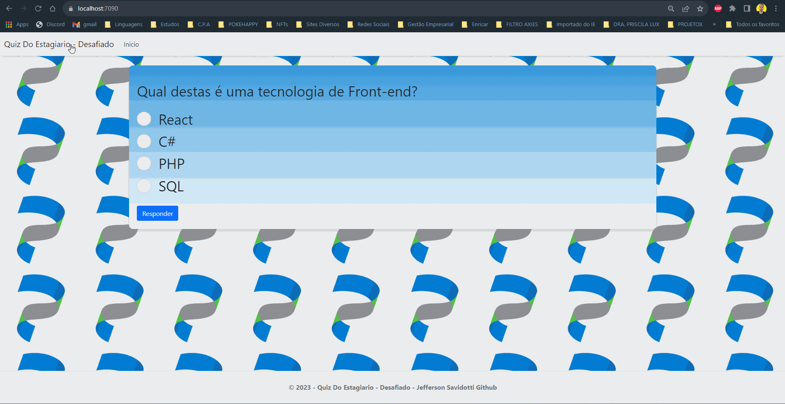

# QuizDoEstagiario_Desafiado

<p align="center">
    
</p>
# Quiz do Estagiário Desafiado 🚀

Bem-vindo ao Quiz do Estagiário Desafiado! 🎉 Prepare-se para testar seus conhecimentos de programação de uma forma divertida e desafiadora. Este quiz foi projetado para entreter e desafiar até mesmo os desenvolvedores mais experientes. Vamos lá!

## Tecnologias Utilizadas 🛠️

- **ASP.NET Core:** Framework para o desenvolvimento de aplicativos web modernos.
- **Razor Pages:** Organização da lógica da aplicação e visualizações.
- **C#:** Linguagem de programação para a lógica do servidor.
- **HTML e CSS:** Estrutura e estilo das páginas web.
- **Bootstrap:** Framework de design front-end para uma interface responsiva e atraente.

## Como Jogar 🎮

1. Clone este repositório na sua máquina local.

   ```bash
   git clone https://github.com/jeffersonsavidotti/QuizDoEstagiario_Desafiado
Abra o terminal e navegue até o diretório do projeto.

    ```bash
    cd QuizDoEstagiario_Desafiado
Execute o projeto usando o comando:

    ```bash
    dotnet run
Abra seu navegador e vá para:

    ```bash
    https://localhost:7090
Responda às perguntas do quiz e veja como você se sai!

## Recursos do Quiz 🌟
Perguntas emocionantes e descontraídas sobre programação.
Respostas embaralhadas para manter você alerta.
Um design interativo e agradável para uma experiência de usuário incrível.
Resultados detalhados mostrando sua pontuação e respostas corretas.

## Contribuindo 🤝
Se você quiser contribuir para o Quiz do Estagiário Desafiado, sinta-se à vontade para abrir problemas, propor novas perguntas ou enviar solicitações de pull. Este é um projeto aberto para tornar o quiz ainda mais incrível!

## Divirta-se! 😄
A equipe por trás do Quiz do Estagiário Desafiado deseja a você muita diversão e sucesso ao responder às perguntas. Mostre o que você sabe e desafie seus amigos a fazerem o mesmo!

Nota: Este quiz foi criado para fins de entretenimento e não deve ser utilizado como uma avaliação formal de habilidades de programação.

Autor: Jefferson Savidotti
